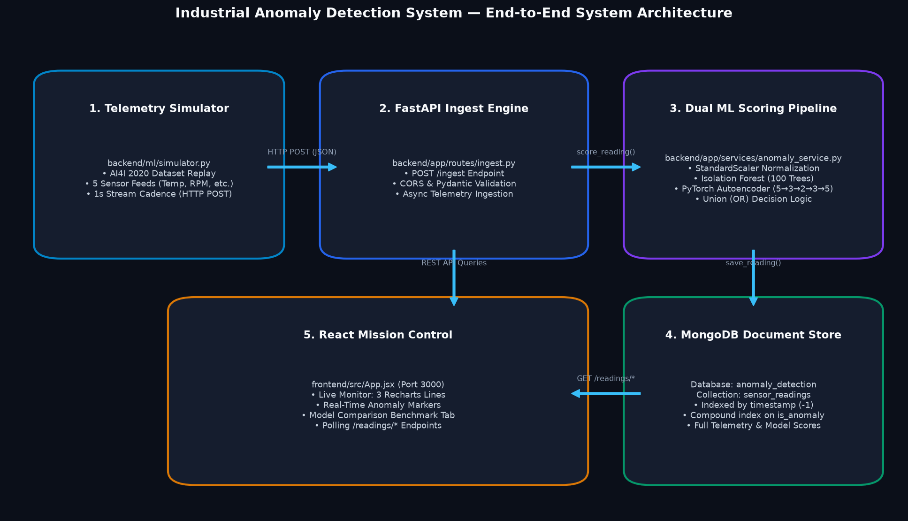

# End-to-End System Architecture



## 1. System Architecture Overview

The **Industrial Anomaly Detection System** is designed as a decoupled, real-time edge-to-cloud IoT monitoring pipeline. The system continuously ingests multi-sensor physical telemetry, performs real-time unsupervised dual-model ML scoring, stores persistent records in MongoDB, and serves live visual dashboards via a React front-end.

```mermaid
graph LR
    subgraph Edge_Simulation["1. Telemetry Edge Simulator"]
        SIM["simulator.py<br/>(AI4I 2020 Replay)"]
    end

    subgraph Backend_FastAPI["2. FastAPI Application Server (:8000)"]
        INGEST["POST /ingest<br/>(Payload Validation)"]
        ROUTERS["GET /readings/*<br/>(recent, anomalies, stats, comparison)"]
        
        subgraph ML_Inference["3. ML Scoring Service"]
            SCALER["StandardScaler<br/>(models/scaler.pkl)"]
            IF["Isolation Forest<br/>(100 Trees, 3.4% Contam)"]
            AE["PyTorch Autoencoder<br/>(5→3→2→3→5, MSE &gt; 2σ)"]
            ENSEMBLE{"Union Decision Logic<br/>is_anomaly = IF || AE"}
        end
    end

    subgraph Database_Layer["4. Storage Layer"]
        MONGO[("MongoDB Database<br/>Collection: sensor_readings<br/>Index: timestamp (-1)")]
    end

    subgraph Frontend_React["5. Mission Control UI (:3000)"]
        DASH["Live Dashboard<br/>(3 Recharts Line Streams,<br/>Status Pill, Incident Table)"]
        COMP["Model Benchmark View<br/>(Side-by-Side Metrics,<br/>Consensus Progress Bar)"]
    end

    SIM -->|HTTP POST /ingest (1s)| INGEST
    INGEST --> SCALER
    SCALER --> IF
    SCALER --> AE
    IF --> ENSEMBLE
    AE --> ENSEMBLE
    ENSEMBLE -->|Scored Reading| MONGO
    MONGO -->|Indexed Query Result| ROUTERS
    ROUTERS -->|REST Polling (2s)| DASH
    ROUTERS -->|Live Benchmark API| COMP
```

---

## 2. Component Specifications

| Stage | Module | Key Technology | Functionality & Role |
|---|---|---|---|
| **1. Edge Simulator** | `backend/ml/simulator.py` | Python, Requests, Pandas | Replays 10,000 continuous sensor rows in chronological order, generating realistic monotonic tool wear progression and sending JSON telemetry to the API. |
| **2. API Gateway** | `backend/app/routes/ingest.py` | FastAPI, Pydantic, Uvicorn | High-throughput asynchronous REST endpoint validating incoming sensor packets (`air_temp`, `rpm`, `torque`, etc.). |
| **3. ML Scoring Engine** | `backend/app/services/anomaly_service.py` | PyTorch, Scikit-Learn, Joblib | Evaluates features through pre-trained StandardScaler, runs Isolation Forest & Autoencoder, and computes the union anomaly boolean. |
| **4. Database Layer** | `backend/app/database.py` | MongoDB, PyMongo | Document-oriented storage with descending timestamp indexing to guarantee sub-millisecond query response times as data scales. |
| **5. Frontend UI** | `frontend/src/` | React 18, Vite, Recharts, Axios | Mission-control dashboard displaying 3 real-time line charts with glowing anomaly markers and a live model comparison benchmark. |

---

## 3. Data Flow Lifecycle

1. **Ingest Transmission:** The edge simulator generates a sensor packet and issues an HTTP `POST /ingest` request.
2. **Feature Normalization:** Sensor values are transformed to zero-mean unit-variance using the pre-fitted `StandardScaler`.
3. **Dual Model Scoring:**
   - **Isolation Forest** evaluates path length to calculate `iso_score` and `iso_flag`.
   - **Deep Autoencoder** computes vector reconstruction error MSE to determine `ae_score` and `ae_flag`.
4. **Ensemble Rule:** `is_anomaly = (iso_flag == 1 or ae_flag == 1)`.
5. **Database Persistence:** The fully scored document is inserted into MongoDB collection `sensor_readings`.
6. **Live Visualization:** The React client polls `GET /readings/recent` every 2 seconds to update charts and incident logs.
